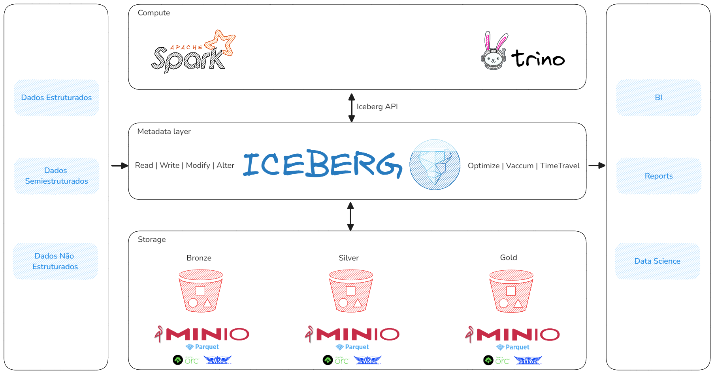
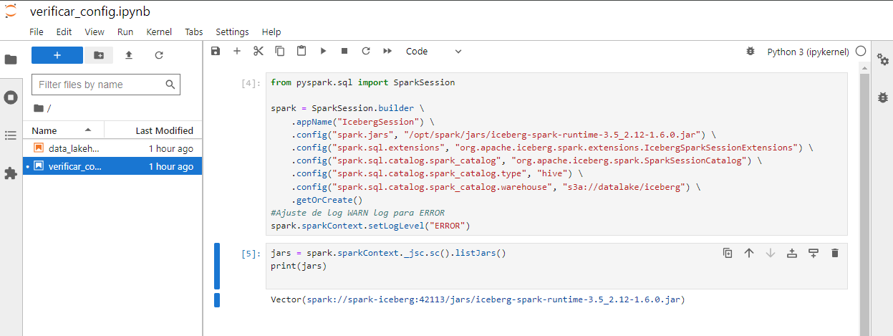
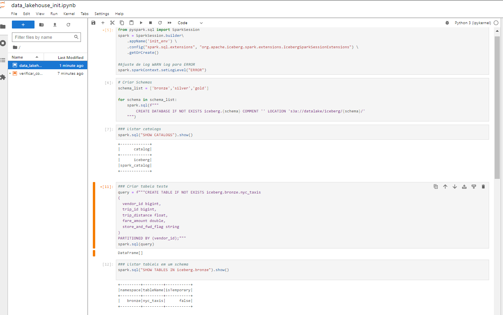
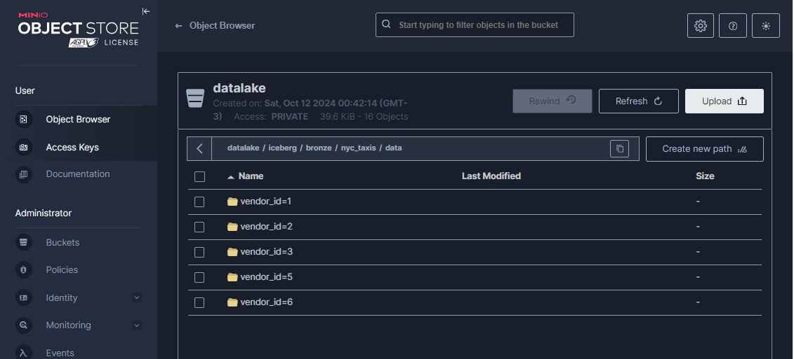

# Apache Iceberg Data Lakehouse

## Disclaimer

Este Lab não deve de forma alguma ser usado em ambiente de produção pelo simples fato de ser um experimento.

## Objetivo Principal

Desenvolvi este pequeno lab para suportar a ninha trilha de aprendizado do Apache Iceberg. Este Lab me permite explorar melhor as funcionalidades de gerenciamento de dados em larga escala, os 'pros' e os 'contras' que envolvem esse formato de tabela.
Além de entender melhor conceitos como versionamento, particionamento dinâmico e otimização de consultas inerentes ao Apache Iceberg. Com isso, espero estar melhor preparado para aplicar essas técnicas em projetos reais e contribuir para soluções de dados mais robustas e modernas.

### Principais Recursos do Apache Iceberg
 - Gerenciamento de Tabelas: Iceberg permite a criação e o gerenciamento de tabelas de forma eficiente, incluindo suporte a transações ACID.

- Particionamento Dinâmico: Permite o particionamento dinâmico, o que significa que você pode adicionar, remover ou modificar partições sem ter que reescrever toda a tabela.

- Schema Evolution: Suporta a evolução do esquema, permitindo adicionar ou modificar colunas facilmente.

- Snapshots: Iceberg mantém um histórico de versões da tabela, o que permite operações como time travel (voltar a uma versão anterior dos dados).

- Suporte a Vários Motores de Computação: Iceberg é compatível com várias engines de processamento, como Apache Spark, Apache Flink e Trino, permitindo consultas SQL eficientes sobre dados armazenados.

- Otimização de Leitura e Escrita: Utiliza técnicas de otimização (Indexação, Compactação) para melhorar a eficiência de leitura e escrita.

## Recursos do Lab
  1. Apache Spark é um motor de processamento de dados em larga escala que permite processamento rápido de dados em batch e em tempo real. Ele suporta vários tipos de cargas de trabalho, incluindo consultas SQL, aprendizado de máquina e processamento de streams.

  2. Apache Iceberg é um formato de tabela open-source projetado para o armazenamento e gerenciamento de grandes conjuntos de dados em data lakes.

  3. MinIO é uma solução de armazenamento de objetos open-source compatível com o S3 (Amazon Simple Storage Service). Ele permite que os usuários armazenem e gerenciem grandes volumes de dados de forma distribuida.

  4. Apache Hive é construído sobre o Apache Hadoop, uma estrutura de código aberto para armazenar e processar grandes conjuntos de dados, neste Lab, ele está sendo usado como o catálogo.

  5. Jupyter Notebook É um ambiente de desenvolvimento interativo que permite a edição e execução de código, bem como a visualização gráfica e textual dos resultados de analises de dados.

  6. Trino é um mecanismo de consulta e virtualização de dados distribuído de código aberto que permite consultar dados em diferentes fontes de forma unificada. Ele é projetado para consultas analíticas rápidas.



## Como Usar

Baixe o projeto

```sh
git clone https://github.com/ac-gomes/spark-iceberg-hive
```
```sh
cd spark-iceberg-hive
```

Execute o comando no terminal do Linux

```sh
docker compose up -d
```

Ao final da execução do docker os recurso estão acessiveis nos endereço:

**Minio S3:** http://localhost:9000

**Spark-iceberg:** http://localhost:8900

**Spark-iceberg Jobs:** http://localhost:4040/jobs/ - Quando um App for criado no Spark ele está disponivel aqui

**Trino:** http://localhost:8889

## Ponto de partida

**Um notebook para verificar se tudo foi instalado e carregado.**



**Um notebook para criar as camadas do data lakehouse, com alguns exemplos.**



**Resultado esperado**



## Tutorial em Video

YouTube: https://youtu.be/OSpUWmOFYQ4

## Introdução ao Apache Iceberg

Primeiras Impressões: https://www.youtube.com/watch?v=sVNRh9yE0_8

Branches & Tags: https://www.youtube.com/watch?v=shfkCf_9ZwQ&t=596s


## Ambiente de Desenvolvimento

```sh
>> wsl -l -v
  NAME            STATE           VERSION
* Ubuntu-20.04    Running         2
```

```sh
>> docker version

 Version:           27.3.1
 API version:       1.47
 Go version:        go1.22.7
 Git commit:        ce12230
 Built:             Fri Sep 20 11:41:03 2024
 OS/Arch:           linux/amd64
```

## Para mais detalhes consulte a documentação

Apache Iceberg e Hive: https://iceberg.apache.org/docs/latest/hive/

Habilitando o suporte Iceberg no Hive: https://iceberg.apache.org/docs/latest/hive/#feature-support

Iceberg e Spark: https://iceberg.apache.org/spark-quickstart/

Trino e Docker: https://trino.io/docs/current/installation/containers.html

Minio Inicio Rápido: https://min.io/docs/minio/container/index.html

A Hands-On Look at the Structure of an Apache Iceberg Table: https://www.dremio.com/blog/a-hands-on-look-at-the-structure-of-an-apache-iceberg-table/

What Is Apache Iceberg? Features & Benefits: https://www.dremio.com/resources/guides/apache-iceberg/

Iceberg Table Spec: https://iceberg.apache.org/spec/

# Enjoy!
